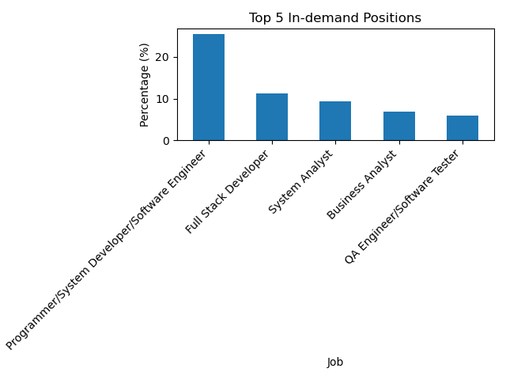
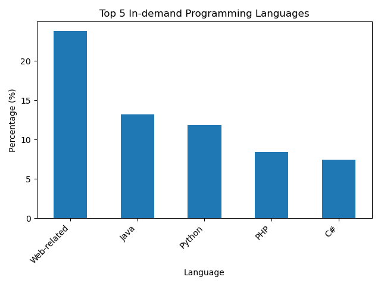

# Analyzing IT Job Trends and Salary Prediction in Thailand – Work in Progress

> Supervised learning models for predicting IT salaries in Thailand, with supporting analysis of job market trends.  

  
  
  
  
  

## Description  
This project applies supervised learning models to predict IT salaries in Thailand and also analyzes related job market trends.  

## Current Progress  
- [x] Collected and processed job market data from JobDB, JobTopGun, and LinkedIn using Python and Pandas.  
- [x] Visualized job trends with Matplotlib (positions, skills, and programming languages).  
- [ ] Building and evaluating supervised learning models with Scikit-learn to predict IT salaries.  

## Technologies  
Python, Pandas, Matplotlib, Scikit-learn  

## Visualizations

  
